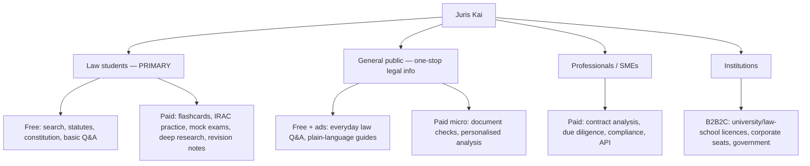
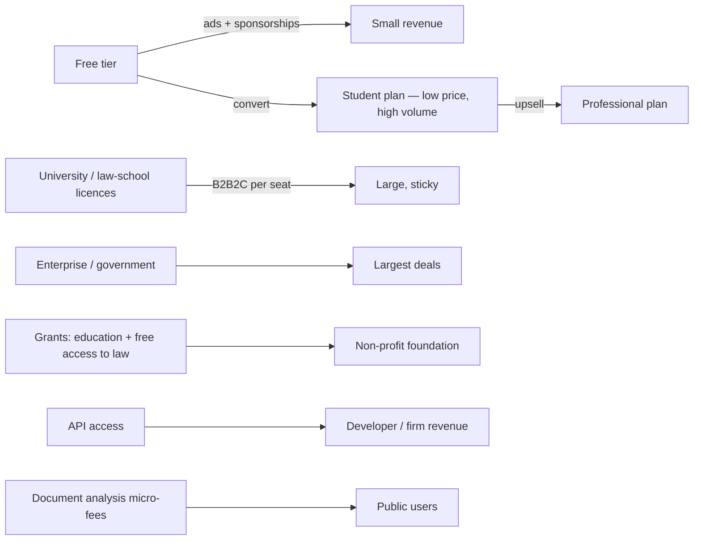

# Juris Kai — DVLA / Corpus Finding + Persona-Based Monetisation

Prepared 2026-09-24. Not legal/financial advice.

## 1. Is DVLA captured? (verified against the live corpus)

| Instrument | In corpus? | Holds |
|---|---|---|
| **Driver and Vehicle Licensing Authority Act, 1999 (Act 569)** | ✅ **Yes (full)** | DVLA's establishment & powers |
| **Road Traffic Act, 2004 (Act 683)** | ✅ **Yes (full)** | Road traffic offences, licensing, vehicle standards |
| **Road Traffic Regulations, 2012 (LI 2180)** | ❌ **No** | **The tint limit / vehicle standards are here** |
| Other transport Acts | Partial | National Road Safety Authority Act 2019 (Act 993), Motor Vehicles (Third-Party Insurance) PNDCL 141, Motor Vehicles (Duplicate Insurance) AFRCD 35 |

**Answer:** the **DVLA is captured** (Act 569) and the **Road Traffic Act** too — but the **actual tinting rule lives in the Road Traffic Regulations (LI 2180), which is NOT in the corpus.** So today a driver asking *"what % tint is legal?"* would get **no grounded answer** (the gateway would refuse rather than guess — correct, but unhelpful).

> **Action:** harvest **LI 2180** (+ the Road Traffic (Amendment) instruments and other transport LIs) from Parliament DSpace, and add a **transport/traffic** area to the coverage analyzer (it currently has none — a taxonomy gap).

---

## 2. Your market: who, and what they'll pay for

### Persona → feature → price map
| Persona | Will pay for | Won't pay for | Best model |
|---|---|---|---|
| **Law student** | Study tools, deep research, revision, past-question practice, citation-accurate notes | Basic statute text (expects free) | **Cheap student subscription** (volume) + free tier |
| **General public (driver, tenant, worker)** | A **plain-language answer** to one question; personal document check | Subscriptions | **Free + ads**, then **micro-payments** for document analysis |
| **Professional/SME** | Contract review, due diligence, drafting, API | — | **Subscription / usage / enterprise** |
| **University / law school** | Class licences, plagiarism-safe research, analytics | — | **Institutional licence (B2B2C)** |
| **Government / regulator** | Verified legislation, compliance tools | — | **Enterprise / sponsored** |

**Insight:** with a student-first audience, the **money is in (a) institutional licences** (universities pay per student, far less churn than individuals) and **(b) low-price high-volume student plans**, not high consumer prices. The **general-public** side is best monetised by **ads + document-analysis micro-fees**, not subscriptions.

---

## 3. What can be monetised (by content type)

| Content / feature | Sellable? | Basis |
|---|---|---|
| **Your software + study tools + user-doc analysis** | ✅ Yes | Your IP / service |
| **Statutes, Constitution, LIs** (as a service) | ✅ Likely | Not copyrightable (s.8(1)(a)); confirm host terms |
| **Plain-language explanations you write** | ✅ Yes | Your work |
| **Judgments / case-law** | ⚠️ Only if commercially licensed | s.8(1)(b) text OK; host terms/access |
| **Headnotes/editorial (third-party)** | ❌ No | Copyright |
| **GhaLII (CC BY-NC) / Laws.Africa (permission)** | ❌ No | Licence — enforced by the commercial gate |
| **User-uploaded documents** | ✅ Service fee (analysis), **never** corpus | User owns it; DPA 843 |

*(Full matrix in `Juris_Kai_monetisation_playbook.md`.)*

---

## 4. Revenue models tuned to a student-first product

| Model | Fit for students | Fit for public | Pros | Cons / limits |
|---|---|---|---|---|
| Free + **ads** | Good | Good | Monetises non-payers | Low CPM; credibility risk; contextual only |
| **Student subscription** | Excellent | — | Recurring, low support | Low price → volume needed |
| **Institutional licence** | Excellent | — | Big, sticky, low churn | Long sales cycle (universities) |
| **Professional subscription** | Upsell | — | High ARPU | Needs trust/coverage |
| **API** | — | — | High margin | Docs + rate limits + commercial gate |
| **Document-analysis micro-fee** | — | Excellent | Direct willingness to pay | DPA compliance; metering |
| **Grants/donations** | (foundation) | (foundation) | Non-dilutive | Restricted use; reporting |
| **Sponsorships** (law firms, bar assoc., publishers) | Good | Good | Brand-aligned | Must not bias answers |
| **Training / CPD** | For grads | — | High margin | Founder time; practice-law limits |

**Ads — realistic view for Ghana:** works only on the **free consumer/public tier**, **contextual** (not behavioural, to limit DPA exposure), never beside a legal answer in a way that implies endorsement, and never on paid tiers. Treat as **supplementary**, not core. Sponsorships (e.g. a law firm sponsoring free student access) typically beat ads in both revenue and credibility.

---

## 5. Where the students are (acquisition → money)

- **Law faculties & the Ghana School of Law** → institutional licences (the single best B2B2C channel).
- **Free exam-season tools** (flashcards, IRAC, past questions) → funnel → paid revision packs.
- **Free public-law explainers** (traffic, tenancy, employment) → SEO/social → ad + micro-fee revenue.
- **Bar association / CPD** → professional tier.

---

## 6. Gaps to close (corpus + product)

| Gap | Fix |
|---|---|
| **LI 2180 / Road Traffic Regulations** (tint) missing | Harvest from Parliament DSpace; classify as transport law |
| **No transport/traffic area** in coverage | Add it + a plain-language "everyday law" layer |
| **Practical/consumer law** thin (tenancy, employment, consumer, traffic) | Targeted harvest + short explainers |
| **Student tools** partly built (flashcards, IRAC menus) | Productise into a paid tier + metering |
| **Institutional auth (seats/SSO)** | Build for university licences |

---

## 7. Recommended next steps

1. **Harvest LI 2180 + transport LIs** and add a **transport** coverage area (fixes the DVLA/tint case).
2. **Build the plain-language "everyday law" layer** for the public persona (ad + micro-fee revenue).
3. **Productise the student tools** into a low-price plan + **institutional seats** with an offline/online licence.
4. **Meter free usage** (protect the GPU) and add **contextual sponsor slots** on the free tier.
5. **Keep the commercial gate** so no NC/editorial content is ever sold.
