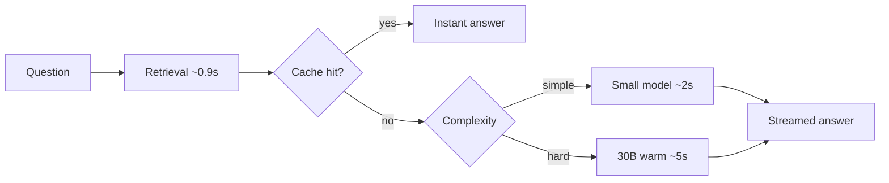
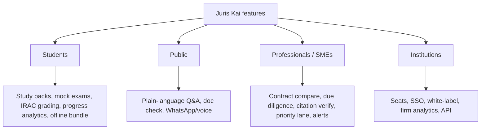
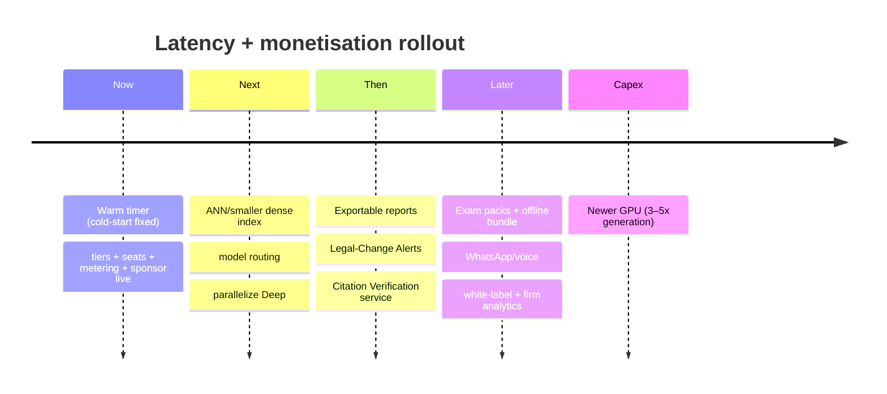

# Juris Kai — Monetisable Features + Latency Playbook

Prepared 2026-09-24. **Measured** on the live VM104 Tesla P40 (not estimated).

---

## Part 1 — Latency: measured reality and the fixes

### The measurement
| Scenario | TTFT | Total | Throughput |
|---|---:|---:|---:|
| **COLD** (model not loaded) | **21.6 s** | 22.0 s | 1 tok/s |
| **WARM** — grounded prompt (~2k chars) | 0.67 s | 5.8 s | 42 tok/s |
| **WARM** — short prompt | 0.14 s | 3.6 s | 50 tok/s |

**Conclusion: generation is fine; the pain is the ~21 s cold-start** (reloading the 18.5 GB `qwen3-coder:kai` after idle). The P40 does ~42–50 tok/s warm — respectable.

### Typical request budget (warm)
```
retrieval (hybrid)  ≈ 0.5–1.0 s   (dense NN scan ~0.9 s)
prefill + generation ≈ 3–6 s
────────────────────────────────
Quick answer        ≈ 4–7 s      ✅ entirely acceptable
Deep Research (3 passes, sequential) ≈ 33–38 s   ⚠️ long
```

### Fixes, ranked by impact
| # | Fix | Impact | Status |
|---|---|---|---|
| 1 | **Keep the model resident** (`keep_alive=24h` + warm timer) | **−21 s** cold-start | ✅ **DONE** (timer `kai-brain-warm.timer`, model now 20.7 GB in VRAM) |
| 2 | **Streaming** (TTFT to the user) | perceived −3–6 s | ✅ built |
| 3 | **Answer-length budgets** (`num_predict`) | −2–4 s | ✅ built |
| 4 | **Caches** (FAQ, retrieval, embeddings, prompt-prefix) | −100% on repeats | ✅ built (expand prompt-prefix/KV cache) |
| 5 | **Faster dense retrieval** (ANN index e.g. HNSW/faiss, or shrink top-K/vectors) | −0.5–0.8 s | ⏳ proposed |
| 6 | **Model routing**: small model for simple/short queries, 30B for hard ones | −40–60% on easy Qs | ⏳ proposed |
| 7 | **Parallelise Deep passes** (advocate ∥ opponent, then judge) | **−30–40%** on Deep (~33 s → ~20 s) | ⏳ proposed |
| 8 | **Template answers** for pure lookups (statute/penalty intents) — no generation | ~instant | ⏳ proposed |
| 9 | **Hardware**: P40 is 2016 (Pascal, no tensor cores). An RTX 4090/A6000/L40S ≈ **3–5×** | −70–80% generation | ⏳ capex |
| 10 | **Speculative decoding** (small draft model) | −20–40% | ⏳ advanced |



**Net:** with fixes 1–4 (mostly done), warm Quick ≈ 4–7 s. Add 5–7 for retrieval/Deep. Hardware (9) is the only way to beat the P40's ~50 tok/s.

---

## Part 2 — Monetisable features (what to add)

### 2a. Existing (already billable)
Subscriptions/tiers · institutional seats · API · Deep Research · report exports (§2b) · free-tier sponsor slot · priority responses (entitlement already exists).

### 2b. New, high-value features to add

| Feature | Who pays | Why it sells | Legality |
|---|---|---|---|
| **Priority fast-lane** (jump the queue / fastest model) | Professionals | Latency *is* the product | ✅ your infra |
| **Exportable reports** (Authority Bundle, Issue Matrix, Chronology → PDF/DOCX) | Students, lawyers | Work product they can file | ✅ your work |
| **Legal-Change Alerts** (subscribe to a topic/law; get notified when it changes) | Firms, compliance, students | Built on the watcher; recurring | ✅ |
| **Citation Verification as a Service** (send a document; get every citation checked) | Firms, publishers, law schools | Unique; we have the engine | ✅ |
| **Contract comparison / redline** (two versions → substantive changes) | SMEs, in-house | High willingness to pay | ✅ service over user docs |
| **Due-diligence packs** | Corporates | Time-saving | ✅ |
| **Exam & study packs** (past questions, mock exams, IRAC grading, personalised study plans, progress analytics) | **Law students (core)** | Direct learning outcome | ✅ your content |
| **Moot-court / brief builder** | Students, juniors | Engagement + skill | ✅ |
| **CPD / course bundles** | Professionals | CPD is a recurring spend | ⚠️ accreditation needed |
| **WhatsApp / voice / USSD access** | Public, low-end phones | Reach in Ghana | ✅ DPA care |
| **Offline "Pocket Law" bundle** | Students, rural | No-data study | ✅ (law not copyrightable) |
| **White-label / embedded** | Firms, universities, regulators | One deal, many users | ✅ licence-gated |
| **Firm analytics** (what your team researches) | Firms | Management insight | ⚠️ DPA, aggregate only |
| **API access** | Developers | Integration | ✅ + commercial gate |
| **"Ask a lawyer" marketplace (referral)** | Users ↔ lawyers | You earn referral; the *lawyer* advises | ⚠️ must NOT become you practising law |
| **Donations / sponsorship** (free student access sponsored by a firm) | Firms, donors (foundation) | Goodwill + revenue | ✅ non-profit arm |

### 2c. Feature → persona → price (graph)


### 2d. What you must NOT monetise (repeat)
Third-party **headnotes/editorial**, **GhaLII (CC BY-NC)**, **Laws.Africa (permission)**, **user personal data** (DPA 2012, Act 843). Enforced by the commercial-use gate.

---

## Part 3 — Prioritised roadmap



**Recommended next three:**
1. **Parallelise Deep passes** (biggest quality-preserving speed win, ~33 s → ~20 s).
2. **Model routing + faster dense retrieval** (cut 0.5–0.8 s retrieval + 40–60% on easy queries).
3. **Ship two money features:** **exportable reports** (students/lawyers) + **Legal-Change Alerts** (the watcher already exists).

---

## Part 4 — Limitations (honest)
- **P40 ceiling** ~50 tok/s; only new hardware breaks it materially.
- **No judgments** → case-law/CPD depth limited until licensed.
- **Cold-start** fixed only while the VM stays up and the timer runs (a VM reboot pays one load).
- **Deep is inherently multi-pass** → keep it opt-in (paid) and parallelise what we can.
- **Ads** remain secondary/low-CPM; **sponsorships** (funding free student access) beat ads.
- **DPA** constrains user-data features (aggregate only; consent; `/forget`).
