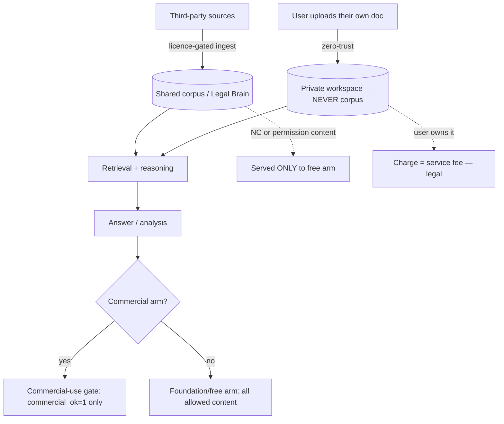
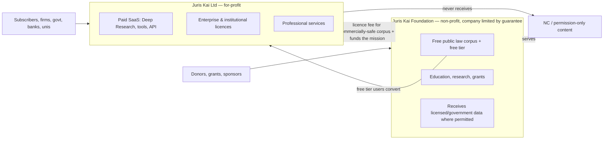
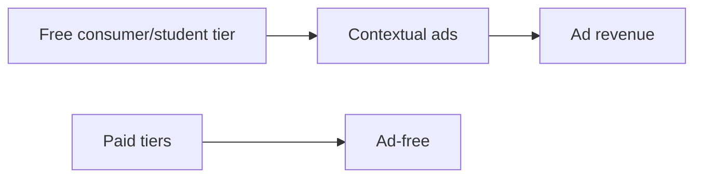
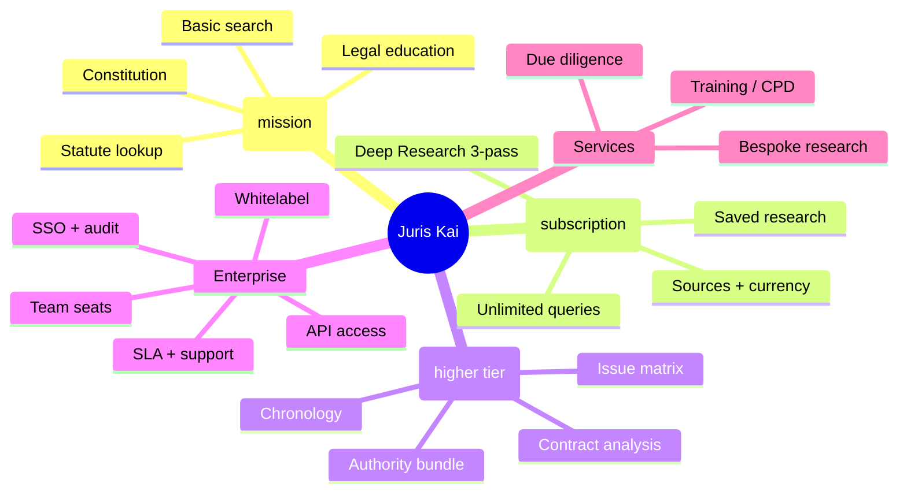
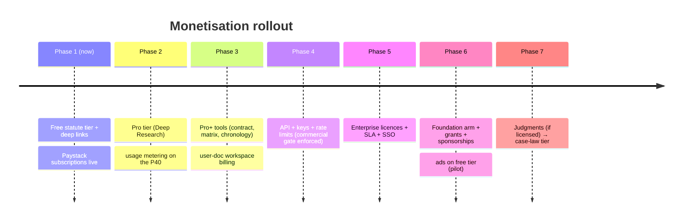

# Juris Kai — Monetisation Playbook (comprehensive)

Prepared 2026-09-24. **Not legal/financial advice** — have a Ghanaian corporate/IP lawyer and a tax adviser review before launch.

---

## 0. The two direct answers

**Q: The user-uploaded personal documents must not enter the legal brain/corpus — can I charge for analysing those documents?**
**Yes.** You are selling a **tool/service over the user's own content**, not redistributing anyone else's copyright. That is the cleanest, safest revenue stream you have. Two conditions:
1. The upload must stay **out of the shared corpus** (already enforced — zero-trust workspace split).
2. You must handle the personal data lawfully (**Data Protection Act 2012, Act 843**): consent/lawful basis, retention limits, security, no training on it without consent, and no publishing it.

**Q: Which features can be monetised, and which cannot?**
Monetise: **your software + analysis services + access to the law**. Do **not** monetise: editorial/headnotes, Non-Commercial (CC BY-NC) sources, permission-required sources (Laws.Africa), or user data sold/redistributed. Full matrix in §4.

---

## 1. Real-world examples (what actually works)

| Model | Example | What they do | Transferable lesson |
|---|---|---|---|
| **Non-profit + commercial subsidiary** | **Mozilla** (Foundation + Mozilla Corp) | Non-profit holds the mission; a taxable subsidiary sells services | The exact hybrid you chose |
| **Non-profit + paid API for big buyers** | **Wikimedia Enterprise** (from Wikimedia Foundation) | Free encyclopedia stays free; a paid API/product for Google/Meta-scale reusers | Charge platforms, keep the public free |
| **Non-profit legal + commercial API** | **Free Law Project / CourtListener** (US 501(c)(3)) | Free public case law **and** paid API, bulk data, support | Closest analogue to Juris Kai |
| **Foundation + member dues** | **Linux Foundation** | Non-profit; companies pay tiers for governance/support | Institutional dues fund the commons |
| **Open core / freemium** | **Grammarly, Notion, Duolingo** | Free tier; paid upgrades | Convert free users to paid |
| **Freemium legal + ads + API** | **Indian Kanoon** | Free case law with ads + paid API/commercial use | Ads can work on the *free consumer* tier |
| **Paid legal research** | **Westlaw, LexisNexis, vLex/Fastcase** | Premium per-seat legal research | Firms pay a lot for trust + coverage |
| **AI legal assistants** | **Casetext (CoCounsel)**, **Harvey**, **Spellbook** | AI drafting/review for lawyers | Sell to professionals, not to consumers |
| **Consumer legal documents** | **LegalZoom, Rocket Lawyer** | Template docs + subscriptions | High-volume, lower price |
| **Cautionary tale** | **Judicata** (shut down) | Legal-research startup ran out of runway | Coverage + trust are hard; monetise early |
| **Foundation + apps** | **Signal Foundation** | Non-profit + separate company operating the app | Keep mission and operations distinct |

**Pattern:** the winners are either (a) a non-profit commons funded by a commercial arm/institutions, or (b) a for-profit SaaS. Almost nobody monetises raw legal text alone — they monetise **workflow, trust, and the tooling**.

---

## 2. The core distinction: corpus content vs user documents

**Why charging for user-doc analysis is clean:**
- The user **owns** (or controls) the uploaded document. You provide a **service** over their content — like Grammarly or a PDF-to-summary tool.
- You are **not** redistributing third-party copyright.
- Ingesting it into the shared corpus would be both a **privacy breach** and a **licence risk** — so it must not happen (and it doesn't).

**Why the corpus is different:** the law text itself isn't copyrightable (enactments s.8(1)(a); decisions s.8(1)(b)), but each **host's terms** and any **Non-Commercial** licence govern *your right to use it in a paid product*. Hence the commercial-use gate.

---

## 3. The hybrid structure (how the money and data flow)

**Governance rules that keep it defensible:**
1. **NC/permission content never crosses into the commercial arm** (enforced by the `commercial_ok` gate already built).
2. Foundation and company have **separate books**, an arm's-length licence, and no improper benefit.
3. The **commercial arm reports to the foundation's mission**, not the other way round.

---

## 4. Monetisation matrix — what CAN vs CANNOT be sold

| Asset / feature | Sellable? | Basis |
|---|---|---|
| **Software** (retrieval, KG, reasoning, agent, UI) | ✅ **Yes** | Your IP |
| **Analysis of the user's own uploaded doc** | ✅ **Yes** | Service over user's content; DPA-compliant |
| **Value-added output** (summaries, issue matrix, chronology, contract review, due diligence, compliance checks) | ✅ **Yes** | Your work product |
| **API access** to the platform | ✅ **Yes** | Your service |
| **Deep Research mode** (3-pass reasoning) | ✅ **Yes** | Your algorithm |
| **Public statute/constitution corpus** (as a service) | ✅ **Likely** | Enactments not copyrightable (s.8(1)(a)); confirm host/DSpace terms |
| **Court judgments** | ⚠️ **Only with a commercial licence** | s.8(1)(b) excludes decisions, but host terms/access control; licence must grant commercial + AI |
| **Government/agency legislation** | ⚠️ **Confirm per source** | Law text OK; host terms may restrict reuse — gate by source |
| **Headnotes / editorial / summaries (third-party)** | ❌ **No** | Protected copyright; not ours |
| **GhaLII content** | ❌ **No** | CC BY-NC (Non-Commercial) |
| **Laws.Africa content** | ❌ **No** | Permission required |
| **Aggregated/sold user data** | ❌ **No** | DPA 843; consent; ethically fraught |
| **Training AI models on licensed corpus to resell the model** | ❌ **No** | NC/AI restrictions |

---

## 5. Revenue models — with pros, cons, limitations

### 5.1 Subscriptions / SaaS tiers
![subscription]
- **Pros:** predictable recurring revenue; aligns with the built Paystack plans; scalable.
- **Cons:** churn; needs ongoing content freshness.
- **Limits:** consumer willingness-to-pay in Ghana is low → offer GHS pricing + annual discounts.

### 5.2 Freemium
- **Pros:** broad funnel; free arm also serves the mission; converts professionals.
- **Cons:** free-tier cost (GPU!) — cap queries; conversion can be <5%.
- **Limits:** must meter usage to protect the P40.

### 5.3 API / usage-based
- **Pros:** developers/firms integrate; high margin; Wikimedia-Enterprise-style.
- **Cons:** needs docs, key mgmt, rate limits, SLAs, abuse protection.
- **Limits:** commercial gate must apply (NC content excluded for API buyers).

### 5.4 Enterprise & institutional licences
- **Pros:** biggest cheques (law firms, banks, corporates, universities, government); annual contracts.
- **Cons:** long sales cycles; procurement/security reviews; bespoke SLAs.
- **Limits:** you'll need uptime, data-protection compliance, and references.

### 5.5 Professional services (bespoke research, contract review, training/CPD)
- **Pros:** high margin, immediate cash, validates product.
- **Cons:** doesn't scale; pulls founder time.
- **Limits:** **unauthorised practice of law** (Legal Profession Act 1960, Act 32) — frame as research/software, not legal advice.

### 5.6 Grants & donations (for the non-profit arm)
- **Pros:** non-dilutive; mission-aligned; funders exist for free-access-to-law (Open Law Africa, Indigo, GIZ, foundations).
- **Cons:** application effort; restricted use; reporting.
- **Limits:** funders often require the *output* to stay open — keep grant-funded work in the foundation.

### 5.7 Sponsorships / partnerships
- **Pros:** bar associations, law schools, regulator portals; credibility.
- **Cons:** slower; reputational alignment matters.

### 5.8 Whitelabel / embedded
- **Pros:** one deal, many users (e.g. a firm embeds Juris Kai).
- **Cons:** customisation; support burden.

### 5.9 **Advertising** (you asked specifically)

- **Pros:** monetises the free tier without charging users; Indian Kanoon does this.
- **Cons:** **low ARPU** in Ghana (CPMs are small); **credibility risk** for legal content; **ethics** — ads beside legal answers can mislead (no "ambulance-chasing" ads); must never let ads influence answers.
- **Limits:** keep ads **off professional/paid tiers**; use **contextual** (not behavioural/tracking) ads to reduce DPA burden; never ad-inject into answers. Realistically a **secondary** revenue line, not primary.

### 5.10 Data insights (aggregate, anonymised)
- **Pros:** trend reports (e.g. most-searched legal topics) can be sold/PR.
- **Cons:** must be **fully anonymised/aggregated**; DPA risk if re-identifiable.
- **Limits:** never sell individual user data; publish only aggregates.

---

## 6. Feature-level monetisation map

| Feature | Tier | Monetise | Note |
|---|---|---|---|
| Basic statute search | Free | No (funnel) | Ads possible |
| Deep Research (3-pass) | Pro | ✅ | Your algorithm |
| Contract analysis (user doc) | Pro+ | ✅ | Service over user content |
| Issue matrix / chronology / authority bundle | Pro+ | ✅ | Work product |
| API | Enterprise | ✅ | Commercial gate applied |
| Enterprise/whitelabel | Enterprise | ✅ | Biggest revenue |
| Judgments / case-law mode | — | ⚠️ | Only once licensed for commercial use |

---

## 7. Limitations & risks (honest)

1. **Judgments are not yet available** → case-law features can't be sold until a commercial licence is granted.
2. **Consumer purchasing power** in Ghana limits subscription pricing → lean on enterprise + institutions.
3. **GPU cost**: free-tier inference on the P40 must be metered or it becomes a cost sink.
4. **Legal-practice boundary**: never cross into giving legal advice; disclaimers + no lawyer-client relationship.
5. **Data protection**: register with the Data Protection Commission; document lawful basis; retention.
6. **Reputational**: hallucination-free positioning requires the citation firewall + no-ungrounded policy (built) to stay on.
7. **Ads**: low CPM, credibility risk — secondary only.
8. **Source drift**: licences can change; the register must be reviewed periodically.
9. **Tax/structure**: get professional structuring advice; non-profit exemption ≠ automatic.

---

## 8. Implementation roadmap (upgrades)

**Concrete upgrades to build next:**
1. **Usage metering + tier enforcement** (already partly there via quota) → protect GPU + enable fair-use free tier.
2. **API product**: API keys, rate limits, per-key commercial flag (auto-applies the gate), usage billing.
3. **Billing tiers** in the Command Center: Free / Pro / Pro+ / Enterprise; map features to the matrix in §6.
4. **User-document workspace billing**: charge per document analysis (service), with a strict DPA notice and no-corpus guarantee.
5. **Enterprise console**: seats, SSO, audit, SLA.
6. **Sponsor/ad slot** on the free tier only (contextual), behind a feature flag.
7. **Licence register review** cadence (already built) + a public "sources & licences" page (trust).

---

## 9. One-paragraph summary

Juris Kai is legally cleanest as a **hybrid**: a **non-profit foundation** holding the free, public-good **law corpus + education**, and a **for-profit company** selling **your software and analysis services**. You **can** charge for analysing a user's own uploaded document (that's a service over their content — keep it out of the corpus and DPA-compliant). You **can** sell access to the **law** (enactments aren't copyrightable) subject to each host's terms, enforced by the **commercial-use gate** you now have. You **cannot** sell third-party editorial/headnotes, **NC** sources (GhaLII), **permission-required** sources (Laws.Africa), or user data. Primary revenue = **subscriptions + enterprise/institutional licences + API + professional services + grants to the foundation**; **ads are a secondary** line for the free consumer tier only. Get a lawyer and a tax adviser to sign off before you charge.
